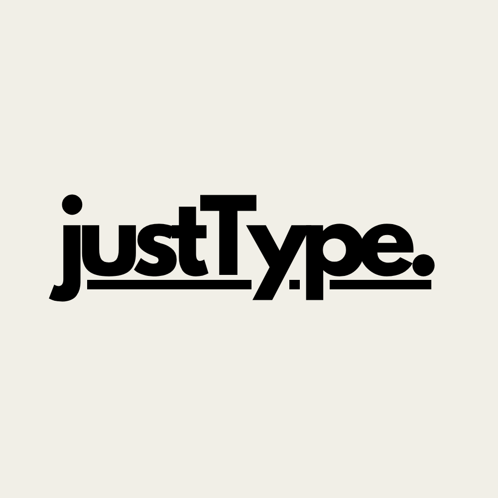

# justType - https://olivcho.github.io/justType/

A minimalist writing space where you can focus on your thoughts while gently connecting with other writers. Write in your preferred font, track your writing time, and discover what others have shared.

  

## Features

- ✍️ Clean, distraction-free writing interface
- ⏱️ Built-in writing timer to track your writing duration
- 🎨 Multiple font options (Arial, Times New Roman, Courier New, Georgia, Verdana)
- 🤝 Share your writing with others
- 📖 Discover random pieces from other writers
- 🕒 See how long others took to write their thoughts

Build with React + Supabase.

## Getting started

Use [justType](https://olivcho.github.io/justType/)!
